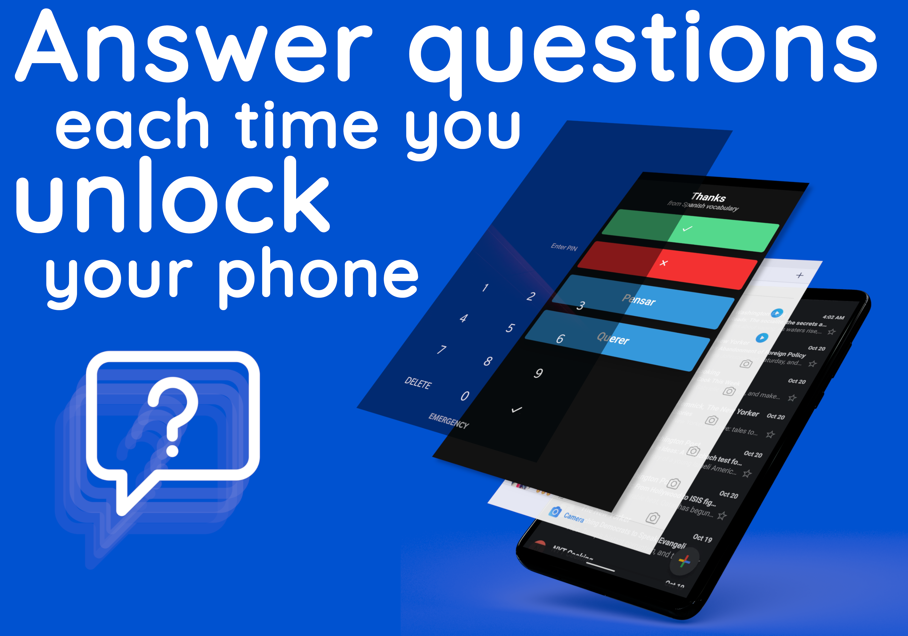
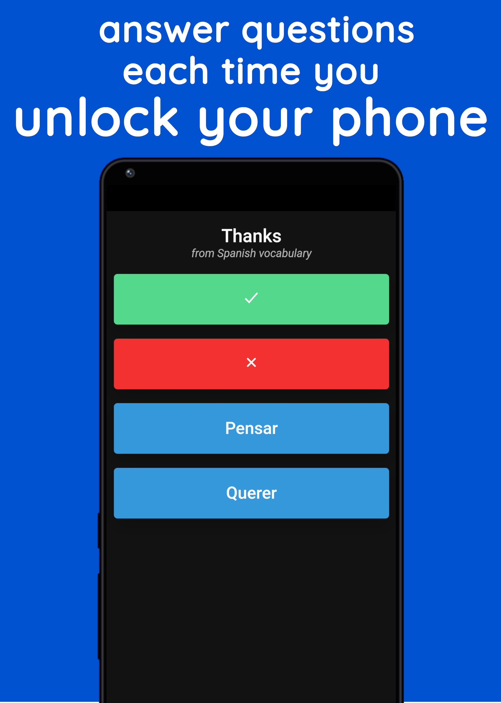
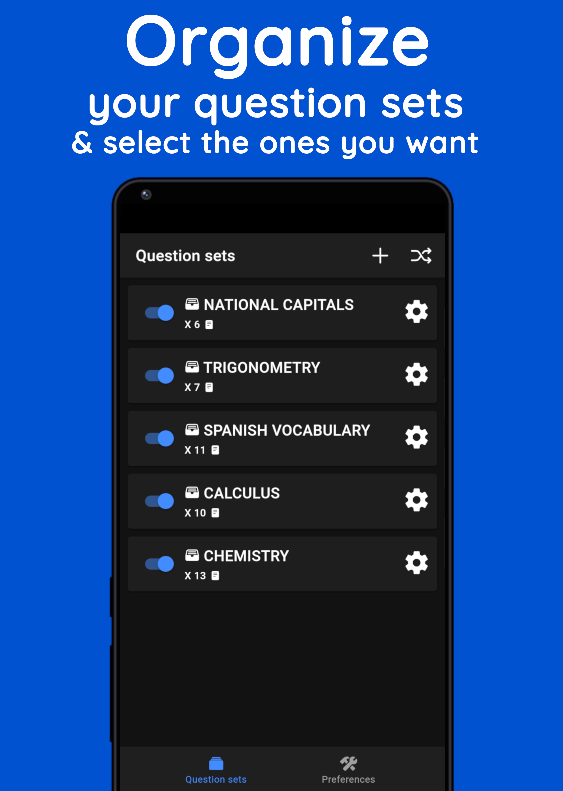
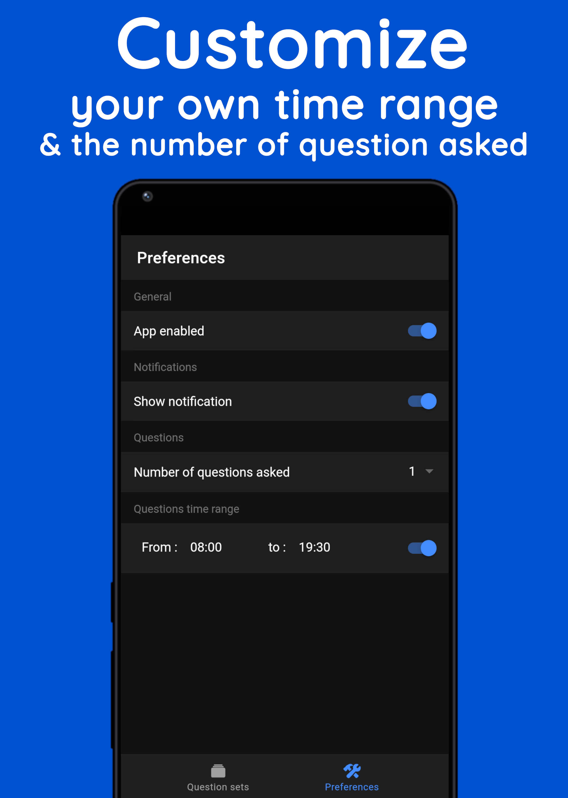
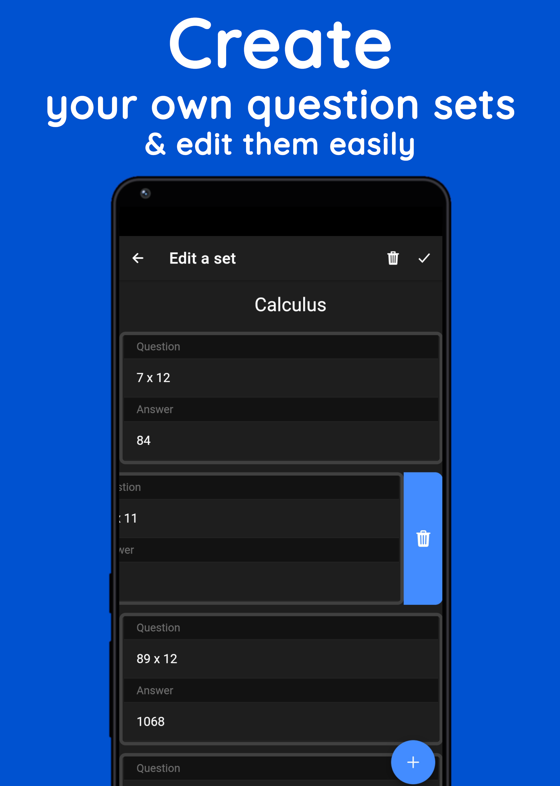

# Unlask

 

An app that asks you questions every time you unlock your phone...

<br>

## Background

The number of times we turn on our phone just to look at the screen or to unthinkingly consult social networks is countless...
Unlask's goal is to transform these little moments into smarter ones and to also, push you to reduce the use of your smartphone.
<br>

## Features 

You can :
- Create unlimited question sets with text questions
- Edit easily your question sets to add, remove and edit questions
- Select time range during which the application will ask you questions
- Disable or enable any question set
- Disable the application or disable the notification

<br>

## Usage 

It is a [Ionic](https://ionicframework.com/) app and it runs only on Android.
To run it, just run ```ionic cordova platform add android``` and then ```ionic cordova run android```. 

I edited the plugin ```cordova-plugin-screenevents``` in order to catch the device wake up event, all the others plugins are unchanged.

<br>

## Visuals

The question page          |   The question sets page
:-------------------------:|:-------------------------:
  |  

<br>

The preference page          |   The set editing page
:-------------------------:|:-------------------------:
  |  

<br>

